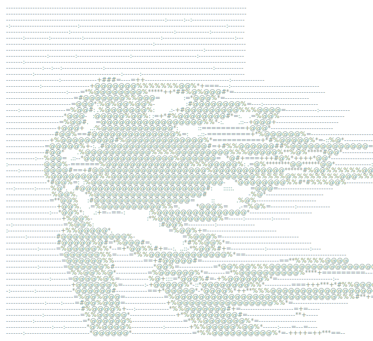

# Hey, I'm Zamphere 👋

**Self-appointed AI architect. Latchkey kid. Sign-industry veteran.** Learning in public 📖 Powered by caffeine and an unreasonable need to ship.

I build AI-powered software for real trades (starting with sign shops), tools that keep AI honest, and the occasional beautiful oddity. Most of it ships under **[Nuralyn](https://github.com/Nuralyn)**.

Looking for me? Sign stuff lives at **[signguy.cc](https://signguy.cc)**, everything else at **[nuralyn.com](https://nuralyn.com)**.

---

## 🏪 For the shops

- **[Wysper](https://wysper.cc)** - Real-time AI sales coaching for sign, print, and custom manufacturing shops. Live cues while the call is happening, a structured quote when it ends. The salesperson is the expert; the AI is the assistant.
- **[SignSho](https://signsho.com)** - Photorealistic sign visualization. A photo of the building plus your artwork in, a true-to-life mockup out. Close the sale before anything is fabricated.
- **[Lynventory](https://lynventory.com)** - Inventory management built specifically for sign shops, not warehouses.
- **[LeadBrief](https://leadbrief.dev)** - Lead enrichment that turns a company name into a sales-ready brief before you dial.

## 🛠️ For freelancers and builders

- **[ClientLine](https://clientline.cc)** - The 60-second client portal for freelancers. One secure link, no client login, the whole project on a single timeline: file requests, deliveries, updates.
- **[Discombobulator](https://discotec.dev)** - Drop your vibecoded disaster, hit the button. A multi-model AI brigade audits and diagnoses your code from every angle, then hands back a production-ready project and a full Discombobulation Report.
- **[LYNS](https://lyns.dev)** - A local-first desktop workspace for people who live in the terminal: multiplexed shells, zoned multi-monitor layouts, and AI tooling that respects your machine.
- **[LYNS Voice](https://lyns.app)** - The voice of Claude Code. Speak a request and Oracle, a glowing holographic orb, listens, thinks, and talks back while conducting parallel Claude sessions. Speech runs entirely on-device: no cloud, no account, no keyboard required.

## 🧠 Keeping AI honest

- **[Bench](https://github.com/Nuralyn/Bench)** - Constitutional governance for Claude Code. Every proposed change is challenged, defended, ruled on, and recorded in an auditable ledger before it touches your files.
- **Claude's Wisdom** *(not yet public)* - An epistemology engine for LLMs. It stores principles instead of facts, then actively tries to break them, so its knowledge gets sharper over time instead of just larger.
- **[Mulberry](https://mulberry.dev)** - A governed AI loop builder. Contracts instead of vibes, export-first by design.

## 🏺 Curiosities

- **[GLYPH](https://github.com/Nuralyn/GLYPH)** - Ground-Level Yield of Patterned Histories. Archaeological pattern analysis that asks whether an ancient site is encoding information. One HTML file, no install. [Live demo](https://glyph.nuralyn.com).
- **[BuildSpin](https://buildspin.win)** - Free to pull. Dangerous to win. A cursed arcade slot machine that mutates your idea into a ridiculous but buildable concept, plus a prompt you can paste into any AI builder.

## 🧰 Tools I reach for

## 📈 Stats

<picture>
  <source media="(prefers-color-scheme: dark)" srcset="https://streak-stats.demolab.com?user=dburks-svg&theme=tokyonight&hide_border=true">
  
</picture>

---

*"Latchkey kid" energy: figure it out, feed yourself, don't wait for permission.*

  

